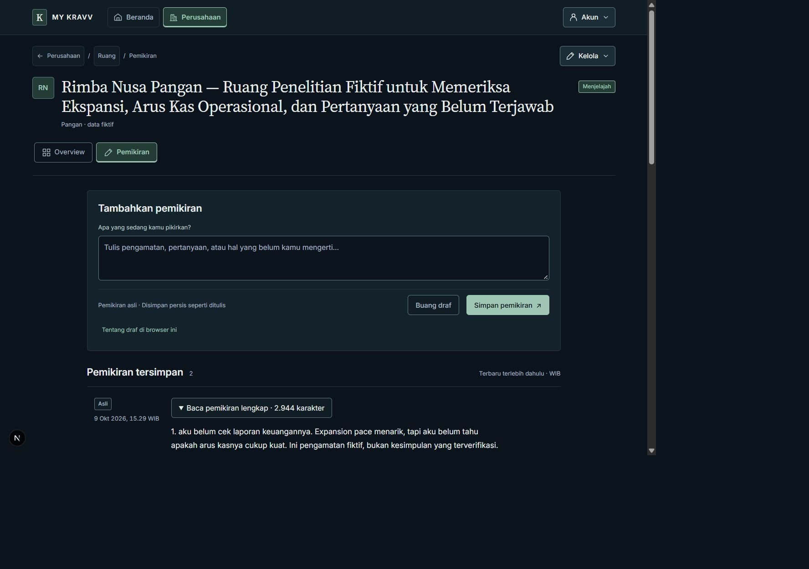
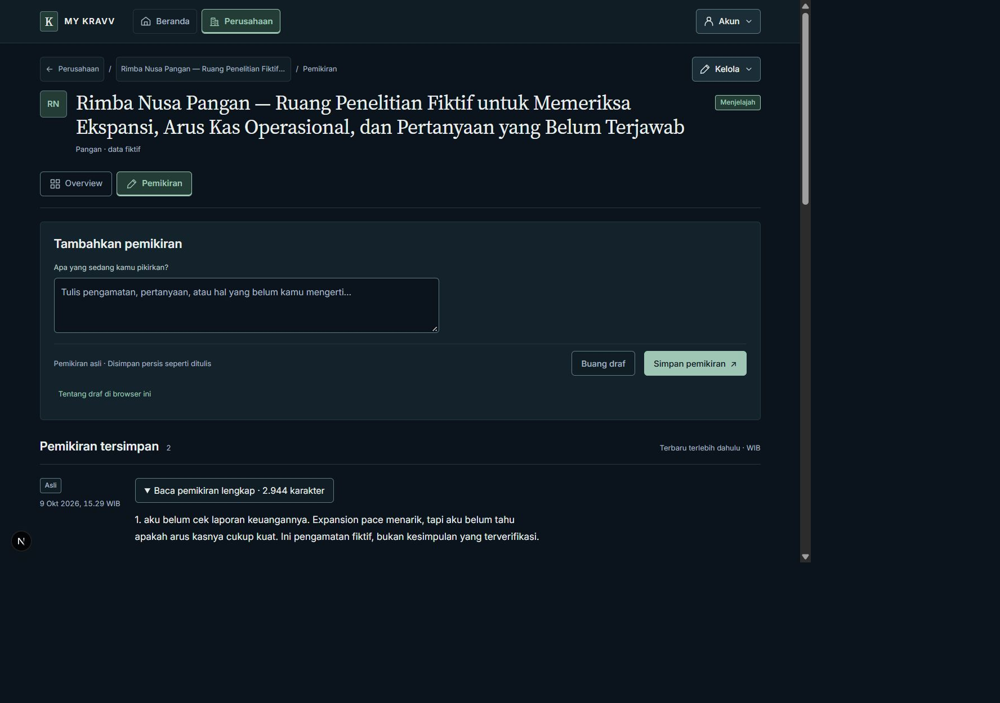

# Phase 3 — Visual Correction A

Actual Next.js application captures, 2026-10-09. Same disposable fictional Rimba
Company and unchanged original/proposal data before and after; no real AI call.
Overview, Pemikiran and the existing nested Refine detail were compared at
1440 / 768 / 390 / 320 **DOM-reported CSS pixels**, height 1000, scroll (0, 0).

| View                   | Before, 1440 CSS px                 | After, 1440 CSS px                |
| ---------------------- | ----------------------------------- | --------------------------------- |
| Overview               | [Before](before-overview-1440.jpg)  | [After](after-overview-1440.jpg)  |
| Pemikiran              | [Before](before-pemikiran-1440.jpg) | [After](after-pemikiran-1440.jpg) |
| Existing Refine detail | [Before](before-refine-1440.jpg)    | [After](after-refine-1440.jpg)    |

The same filename pattern supplies all tablet/mobile pairs. Three extra after
captures cover empty Overview at 1440/320 and a long original in Refine at 320.
There are 27 unretouched JPEGs. See [image dimensions](capture-manifest.json).

## Measurements

[Before geometry](before-metrics.json), [after geometry](after-metrics.json),
[alignment summary](alignment-summary.json), [extra cases](additional-metrics.json),
and [runtime/focus evidence](runtime-summary.json).

| CSS viewport | Shared left edge after | Identity top | Local nav top | Divider bottom | Content top | Maximum difference across routes |
| ------------ | ---------------------- | ------------ | ------------- | -------------- | ----------- | -------------------------------- |
| 1440         | 70.5                   | 161          | 300.8125      | 369.8125       | 393.8125    | 0 px                             |
| 768          | 24                     | 161          | 430.375       | 499.375        | 523.375     | 0 px                             |
| 390          | 16                     | 193          | 500           | 569            | 593         | 0 px                             |
| 320          | 16                     | 193          | 533.59375     | 602.59375      | 626.59375   | 0 px                             |

Before: Pemikiran's centered 1040px wrapper added 120px to the desktop left edge.
Mobile breadcrumb wrapping shifted the identity/divider by 29.4375px at 390 and
22.5625px at 320. Local links had an unnecessary 4px horizontal outer inset.
All these differences are removed. Header-to-content spacing is now 24px; desktop
topline and divider padding each lose 8px of redundant spacing.

The 70.5px desktop edge is the centered 1280px shell inside a 1421px document
client area: the 1440px viewport includes a 19px scrollbar. It is not a CSS zoom
offset. Tablet/mobile retain 24/16px shell gutters.

Intentional differences remain: Overview's 280px useful context column and panel
padding; Pemikiran's 145px metadata column plus 24px gap on desktop, collapsing on
mobile; and Refine's existing Back/intro/review stack and 58rem working sections.
Panel outer edges share the grid; inner reading text need not share identical
coordinates across these distinct tasks. Originals remain capped at 68ch; the
composer textarea now has an inner 68ch cap instead of centering its whole page.
Thought rows lose redundant horizontal padding. No Refine redesign.

## Verification conditions and limits

CSS zoom **1**, visual viewport scale **1**, reported DPR approximately **0.8**,
unchanged native browser zoom throughout all pairs. **Native zoom percentage is
unverified.** DPR and exported image size cannot establish 80% or 100% native zoom.
The in-app capture canvas can include scaling/blank space beyond the rendered
viewport; use recorded DOM geometry, not image dimensions, for CSS comparisons.
Native 100% and user-observed 80% remain separate manual checks.

No document/local-navigation overflow in the 12 corrected cases or three extra
cases. Long Company h1 stays complete and wraps; its compact breadcrumb is
visually ellipsized, with full accessible name and title. Fonts loaded; measured
main buttons, summaries and navigation links are at least 44px high. Mobile
textarea remains 16px. Local-navigation keyboard focus is inset and visible;
selected states, navigation, management disclosure and Escape close were checked.
Browser warning/error log was empty; dev indicators remain enabled.

Existing safe-area-aware mobile rail/footer CSS is preserved. Zero-inset viewport
simulation is verified; a physical device with nonzero safe-area insets and actual
phone keyboard remains unverified. No accessibility conformance claim.

Only four presentation files changed for this correction. See the appended
[Phase 3 implementation report](../../docs/18-milestone-5.5-phase-3-notes.md).
No data/service/action/test changes, new routes, preferred-version phase, provider
request, commit or push. Stop for user review.
