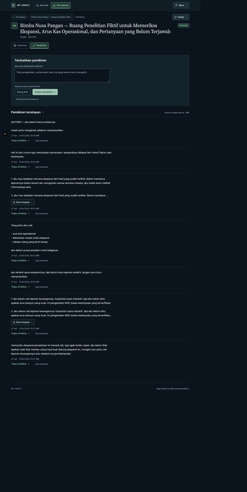
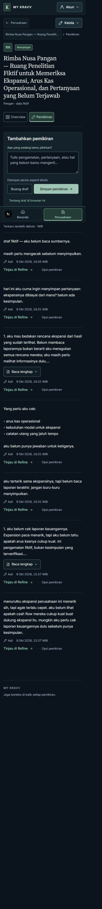

# Phase 3 — Visual Correction B: Pemikiran

Actual Next.js application screenshots, 2026-10-09; disposable fictional data.
The reading/writing page now puts text first, followed by compact source/date
metadata and contextual navigation. No AI generation or proposal review lives
on this page. No real AI request was made.

| CSS viewport | Writing area                  | Full page with seven short, long and multiline originals |
| ------------ | ----------------------------- | -------------------------------------------------------- |
| 1440         | [Composer](composer-1440.jpg) | [Reading stream](mixed-full-1440.jpg)                    |
| 768          | [Composer](composer-768.jpg)  | [Reading stream](mixed-full-768.jpg)                     |
| 390          | [Composer](composer-390.jpg)  | [Reading stream](mixed-full-390.jpg)                     |
| 320          | [Composer](composer-320.jpg)  | [Reading stream](mixed-full-320.jpg)                     |

[Before polishing](before-desktop.jpg), [secondary options](mobile-options-320.jpg),
[render measurements](render-metrics.json), [runtime/interaction checks](runtime-summary.json),
and [actual export dimensions](capture-manifest.json).

Additional `many`, `older`, `focused`, `archived` and `empty` screenshots use the
same four-width naming pattern. Many-Thought fixtures contain 25 originals:
the current window has twenty; the next has five, with no repeated/missing IDs.
Long entries have an honest five-line visual preview of the exact source, not a
generated summary. Native full-reading disclosure exposes the complete unchanged
text. Focus/saved targets open automatically; an ordinary first entry no longer
forces a multi-screen expansion. Short Thoughts are already fully readable.

The original's single compact Asli indicator is secondary to its content. Refine
is a labeled existing deep link; Opsi pemikiran is a quieter native disclosure.
Deletion remains behind the same irreversible-action explanation, required
checkbox and original Server Action. Its error-triggered opening is retained;
there is no outer disclosure to hide server feedback. Keyboard operation and
confirmation requirements were inspected without deleting through the browser.

Composer: compact writing surface, one exact-storage helper, nearby draft/save
controls with matching DOM/visual order, no redundant action divider or empty
feedback spacing. Full draft privacy and recovery text, live errors, receipt
handling and Home's existing copy remain intact. No philosophy sidebar.

## Verification

Twenty-four final cases: mixed / many / older / focused / archived / empty at
1440 / 768 / 390 / 320 DOM-reported CSS px, height 1000. No document or local-nav
overflow; measured visible main controls are at least 44px and textarea text is
16px. Fonts loaded. Normal focused-page shared edges and content start match Correction A
exactly: x = 70.5 / 24 / 16 / 16px. Short desktop pages without a scrollbar use
80px rather than 70.5px because their client area is 19px wider; their header and
body still share the same edge. Mixed-case measurements immediately after full-page
export also show an 80px desktop edge because the capture temporarily removes the
scrollbar; their measurement context is explicitly marked in the JSON. This
export effect is separate from the normal viewport comparison. Reading stays left-aligned and at most 68ch.
Selected entries have a purposeful 12px inset to clear the focus marker.

Browser interaction checks cover exact seeded text at all four widths, keyboard
reading/options expansion, validation, privacy disclosure, navigation/reload draft
recovery, a real synthetic capture and exact receipt/anchor, legacy focus dispatch,
specific Refine GET navigation and stable 20+5 pagination. No inline generation or
review controls were found. Browser warning/error log empty; dev indicators active.

Native browser zoom percentage is unverified and unchanged. CSS zoom 1 and visual
viewport scale 1 are separate recorded values; DPR approximately 0.8 does not
establish 80% native zoom. In-app exports can scale/trim the canvas or include
blank space. Full-page mobile exports can place the fixed rail within the sheet;
they do not prove physical phone keyboard or nonzero safe-area behavior. Those,
native 100%/80% zoom and screen-reader checks remain manual checkpoints.

Only original text is supplied today. The text-reading renderer is separate from
its caller's provenance/version choice; future approved preferred-version reading
can supply its projection without replacing the capture or reading controls.
No accepted-version query, fabricated state, new route, Refine index or Referensi.

See [Phase 3 notes](../../docs/18-milestone-5.5-phase-3-notes.md) for quality gates,
exact changes and preservation. No commit or push. Stop for user review.
