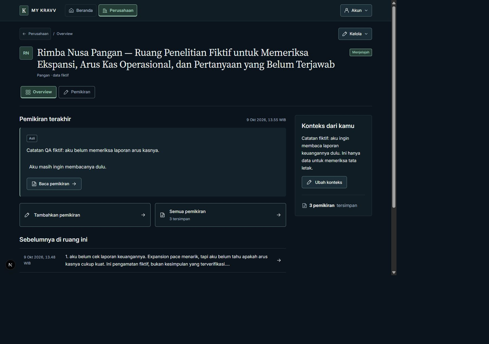
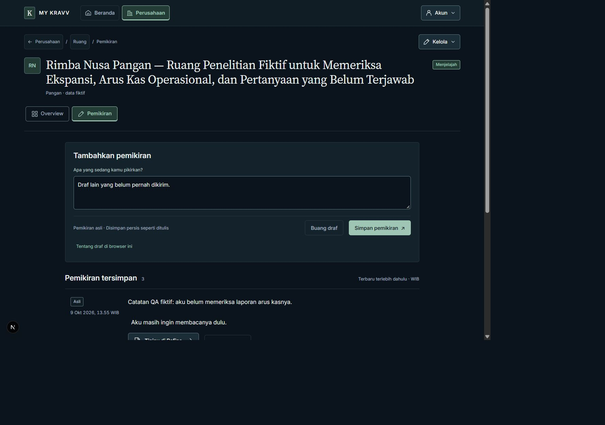

# Milestone 5.5 Phase 3 — actual application QA

These are **unretouched captures of the real Next.js application**, using only a
marked disposable development account and fictional Indonesian data. They are
not the earlier static design prototypes. The account and all eight owned-table
cascades were removed after sign-out; its ignored credential file was removed.
No real AI provider request was made.

## Primary review

| View                           | Desktop                            | Tablet                           | Mobile                           | Narrow mobile                    |
| ------------------------------ | ---------------------------------- | -------------------------------- | -------------------------------- | -------------------------------- |
| Overview                       | [1440](overview-1440.jpg)          | [768](overview-768.jpg)          | [390](overview-390.jpg)          | [320](overview-320.jpg)          |
| Pemikiran                      | [1440](thoughts-1440.jpg)          | [768](thoughts-768.jpg)          | [390](thoughts-390.jpg)          | [320](thoughts-320.jpg)          |
| Empty Overview                 | [1440](empty-overview-1440.jpg)    | [768](empty-overview-768.jpg)    | [390](empty-overview-390.jpg)    | [320](empty-overview-320.jpg)    |
| Empty Pemikiran                | [1440](empty-thoughts-1440.jpg)    | [768](empty-thoughts-768.jpg)    | [390](empty-thoughts-390.jpg)    | [320](empty-thoughts-320.jpg)    |
| Archived Overview              | [1440](archived-overview-1440.jpg) | [768](archived-overview-768.jpg) | [390](archived-overview-390.jpg) | [320](archived-overview-320.jpg) |
| Archived Pemikiran             | [1440](archived-thoughts-1440.jpg) | [768](archived-thoughts-768.jpg) | [390](archived-thoughts-390.jpg) | [320](archived-thoughts-320.jpg) |
| 25-Thought Overview            | [1440](many-overview-1440.jpg)     | [768](many-overview-768.jpg)     | [390](many-overview-390.jpg)     | [320](many-overview-320.jpg)     |
| 20-item history window         | [1440](many-thoughts-1440.jpg)     | [768](many-thoughts-768.jpg)     | [390](many-thoughts-390.jpg)     | [320](many-thoughts-320.jpg)     |
| Older five-item window         | [1440](older-thoughts-1440.jpg)    | [768](older-thoughts-768.jpg)    | [390](older-thoughts-390.jpg)    | [320](older-thoughts-320.jpg)    |
| Off-page saved/focused Thought | [1440](off-page-thought-1440.jpg)  | [768](off-page-thought-768.jpg)  | [390](off-page-thought-390.jpg)  | [320](off-page-thought-320.jpg)  |
| Long original, focused         | [1440](long-thought-1440.jpg)      | [768](long-thought-768.jpg)      | [390](long-thought-390.jpg)      | [320](long-thought-320.jpg)      |
| Existing Refine detail         | [1440](refine-1440.jpg)            | [768](refine-768.jpg)            | [390](refine-390.jpg)            | [320](refine-320.jpg)            |

## Additional states

- One-Thought Overview before the fixture Thought was deleted:
  [1440](one-overview-1440.jpg), [768](one-overview-768.jpg),
  [390](one-overview-390.jpg), [320](one-overview-320.jpg).
- [Save receipt](saved-receipt-390.jpg),
  [combined off-page save/focus](off-page-saved-focus-390.jpg),
  [validation](capture-validation-390.jpg),
  [management expanded](management-open-390.jpg).
- [Retained draft after archive](archived-retained-draft-320.jpg),
  [deleted Company descendant](deleted-company-unavailable-320.jpg),
  [keyboard focus on Save](keyboard-save-focus-390.jpg).
- Full-page context exports: [Overview](overview-390-full.jpg),
  [Pemikiran](thoughts-390-full.jpg).

## Measurements and limitations

[Render metrics](render-metrics.json) contain 48 final cases: twelve views at four
**DOM-confirmed CSS widths**. Individual matching JSON files preserve per-view
measurements. All 48 have no page-wide overflow or clipped Company section link,
loaded fonts, visible main native links/buttons/summaries at least 44px high, and
visible form text at least 16px. Section selection is Overview/Pemikiran; existing
Refine selects neither unfinished local section and retains its Refine breadcrumb.

[Image manifest](capture-manifest.json) records actual dimensions of all 61 JPEGs.
The in-app screenshot surface scales/trims output and can leave unused canvas.
Image pixel dimensions are **not** CSS viewport dimensions. Viewport overrides were
adjusted only to obtain the requested DOM widths. A focused/hash view intentionally
scrolls to its target, so its viewport capture may omit the header. Full-page
exports include context but may place the fixed bottom rail within the exported
sheet; they do not establish phone keyboard behavior.

CSS zoom was 1; native browser 100% zoom was not independently verified. No actual
phone software keyboard, screen-reader session, forced font fallback or 200% text
zoom pass is claimed. Keyboard focus reached Save above the visible mobile rail;
management hash/menu access opened and focused its native summary. Browser console
warning/error inspection returned zero entries. See
[Phase 3 notes](../../docs/18-milestone-5.5-phase-3-notes.md) for compatibility,
security checks and the remaining implementation checkpoints.
