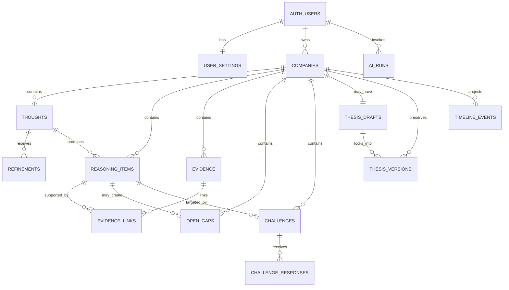

# MY KRAVV — Database Schema

> Status: Draft v0.1  
> Target: PostgreSQL / Supabase  
> Depends on:
> - `01-product-foundation.md`
> - `02-core-user-journey.md`
> - `03-ai-behavior-spec.md`
> - `04-domain-model.md`
> - `05-mvp-scope.md`
> - `06-technical-architecture.md`
> - `07-page-responsibilities.md`
> - `08-design-direction.md`
>
> Purpose:
> Define the canonical MVP database shape for MY KRAVV so implementation can
> preserve raw thinking, reasoning history, thesis immutability, private ownership,
> and AI provenance without overengineering the system.

---

# 1. Schema Philosophy

The database should optimize for:

```text
history
clarity
ownership
relational integrity
AI provenance
simple querying
future growth
```

Not for:

```text
maximum abstraction
event sourcing
premature vector search
microservice boundaries
generic CMS flexibility
```

Core rule:

> **Use normal relational tables for domain truth. Use JSONB only where a frozen
> snapshot or flexible metadata genuinely needs it.**

---

# 2. Database Engine

Recommended:

```text
PostgreSQL
```

Preferred MVP host:

```text
Supabase
```

Use:

```text
UUID primary keys
TIMESTAMPTZ timestamps
foreign keys
CHECK constraints
Row Level Security
transactional writes
```

All timestamps should be stored in UTC and rendered in the user's locale.

---

# 3. Authentication Boundary

Supabase provides:

```text
auth.users
```

MY KRAVV domain tables should reference:

```text
auth.users.id
```

The application should not create its own password table.

---

# 4. Ownership Strategy

Every private domain row should have:

```text
user_id UUID NOT NULL
```

even when ownership could technically be inferred through `company_id`.

This is deliberate.

Benefits:

```text
simple RLS
simple filtering
safer debugging
faster ownership checks
clear data export/deletion
```

Where possible, database constraints should ensure:

```text
child.user_id == parent.user_id
```

---

# 5. ID and Naming Rules

Use:

```text
snake_case
UUID primary keys
singular conceptual entity → plural table
```

Examples:

```text
companies
thoughts
refinements
reasoning_items
```

Primary key:

```sql
id uuid primary key default gen_random_uuid()
```

---

# 6. Status / Enum Strategy

For MVP, prefer:

```text
TEXT + CHECK constraint
```

instead of PostgreSQL ENUM for most evolving product states.

Reason:

MY KRAVV is still iterating and states may change.

Example:

```sql
status text not null
check (status in ('OPEN', 'ANSWERED', 'UNRESOLVED', 'DISMISSED'))
```

Stable database-native enums may be introduced later if useful.

---

# 7. Core Relationship Map



---

# 8. MVP Table Set

Canonical MVP tables:

```text
user_settings
companies
thoughts
refinements
reasoning_items
evidence
evidence_links
open_gaps
challenges
challenge_responses
thesis_drafts
thesis_versions
ai_runs
timeline_events
```

Deferred:

```text
decisions
transactions
portfolio_positions
reviews
documents
reflection_reports
market_snapshots
```

---

# 9. `user_settings`

One row per authenticated user.

Purpose:

```text
personal preferences
AI behavior
budget controls
application language
display preferences
```

Suggested columns:

```sql
user_id uuid primary key references auth.users(id) on delete cascade,

display_name text,

app_language text not null default 'id-ID'
    check (app_language in ('id-ID', 'en-US')),

guidance_mode text not null default 'ADAPTIVE'
    check (guidance_mode in ('MORE', 'ADAPTIVE', 'MINIMAL')),

challenge_intensity text not null default 'STANDARD'
    check (challenge_intensity in ('LIGHT', 'STANDARD', 'DEEP')),

refine_tone text not null default 'NATURAL',

theme_key text not null default 'HYBRID_KRAVV',

monthly_ai_budget_idr numeric(12,2),

ai_enabled boolean not null default true,

created_at timestamptz not null default now(),
updated_at timestamptz not null default now()
```

Notes:

- Budget is user-configurable.
- `NULL monthly_ai_budget_idr` can mean no hard user-defined limit.
- Do not store provider API keys here.

---

# 10. `companies`

Primary organizational anchor.

Suggested columns:

```sql
id uuid primary key default gen_random_uuid(),

user_id uuid not null references auth.users(id) on delete cascade,

name text not null,
ticker text,
exchange text,
sector text,
short_note text,

state text not null default 'EXPLORING'
    check (
      state in (
        'EXPLORING',
        'DEVELOPING',
        'THESIS_FORMED',
        'TRACKING',
        'REVIEWING',
        'ARCHIVED'
      )
    ),

archived_at timestamptz,

created_at timestamptz not null default now(),
updated_at timestamptz not null default now(),

unique (id, user_id)
```

Do not require:

```text
market cap
current price
financial ratios
live market metadata
```

Company metadata should remain lightweight in MVP.

---

# 11. `thoughts`

Stores original user thinking.

This table is historically important.

Suggested columns:

```sql
id uuid primary key default gen_random_uuid(),

user_id uuid not null references auth.users(id) on delete cascade,
company_id uuid not null,

raw_content text not null,

intent text
    check (
      intent is null or intent in (
        'RAW_THOUGHT',
        'RESEARCH_NOTE',
        'EVIDENCE_UPDATE',
        'OPEN_QUESTION',
        'THESIS_THOUGHT',
        'DECISION_NOTE',
        'REVIEW_REFLECTION',
        'UNKNOWN_MIXED'
      )
    ),

created_at timestamptz not null default now(),

foreign key (company_id, user_id)
    references companies(id, user_id)
    on delete cascade
```

Important invariant:

> `raw_content` is immutable after creation.

If the user changes their mind, preserve the original and create a new thought,
refinement, or later reasoning item instead of silently overwriting history.

---

# 12. Thought Deletion

MVP behavior:

- User may permanently delete their private data through explicit destructive action.
- Normal editing must not rewrite `raw_content`.
- Company deletion may cascade-delete all private company data.

Do not use "soft delete everything" by default.

---

# 13. `refinements`

Stores AI-assisted rewrites separately from raw input.

Suggested columns:

```sql
id uuid primary key default gen_random_uuid(),

user_id uuid not null references auth.users(id) on delete cascade,
company_id uuid not null,
thought_id uuid not null references thoughts(id) on delete cascade,

ai_run_id uuid,

ai_content text not null,
user_final_content text,

status text not null default 'SUGGESTED'
    check (
      status in (
        'SUGGESTED',
        'ACCEPTED',
        'REJECTED',
        'SUPERSEDED'
      )
    ),

created_at timestamptz not null default now(),
resolved_at timestamptz,

foreign key (company_id, user_id)
    references companies(id, user_id)
    on delete cascade
```

Meaning:

```text
ai_content        = what AI proposed
user_final_content = optional user-edited accepted version
```

Raw user text still lives only in `thoughts`.

---

# 14. `reasoning_items`

Structured meaning extracted or written by the user.

Types:

```text
CLAIM
INTERPRETATION
ASSUMPTION
RISK
CATALYST
UNCERTAINTY
```

Suggested columns:

```sql
id uuid primary key default gen_random_uuid(),

user_id uuid not null references auth.users(id) on delete cascade,
company_id uuid not null,

type text not null
    check (
      type in (
        'CLAIM',
        'INTERPRETATION',
        'ASSUMPTION',
        'RISK',
        'CATALYST',
        'UNCERTAINTY'
      )
    ),

content text not null,

source_kind text not null
    check (
      source_kind in (
        'USER_RAW',
        'USER_FINAL',
        'AI_STRUCTURE',
        'AI_REFINED'
      )
    ),

source_thought_id uuid references thoughts(id) on delete set null,
source_refinement_id uuid references refinements(id) on delete set null,

supersedes_reasoning_item_id uuid references reasoning_items(id) on delete set null,

status text not null default 'ACTIVE'
    check (status in ('ACTIVE', 'SUPERSEDED', 'RETRACTED')),

created_at timestamptz not null default now(),

foreign key (company_id, user_id)
    references companies(id, user_id)
    on delete cascade
```

Recommended rule:

> Prefer creating a new reasoning item that supersedes an old one rather than
> rewriting historical meaning in place.

---

# 15. `evidence`

Stores evidence separately from interpretation.

Suggested columns:

```sql
id uuid primary key default gen_random_uuid(),

user_id uuid not null references auth.users(id) on delete cascade,
company_id uuid not null,

fact_text text not null,

source_title text,
source_url text,
source_date date,

user_note text,

provenance text not null default 'USER_PROVIDED'
    check (
      provenance in (
        'USER_PROVIDED',
        'EXTERNAL_EVIDENCE',
        'MANUAL_ENTRY'
      )
    ),

created_at timestamptz not null default now(),

foreign key (company_id, user_id)
    references companies(id, user_id)
    on delete cascade
```

Do not merge:

```text
source fact
user interpretation
```

into one field.

---

# 16. `evidence_links`

Connects Evidence to Reasoning or an Open Gap.

Suggested columns:

```sql
id uuid primary key default gen_random_uuid(),

user_id uuid not null references auth.users(id) on delete cascade,
company_id uuid not null,

evidence_id uuid not null references evidence(id) on delete cascade,

reasoning_item_id uuid references reasoning_items(id) on delete cascade,
open_gap_id uuid references open_gaps(id) on delete cascade,

relation text not null
    check (
      relation in (
        'SUPPORTS',
        'WEAKENS',
        'CONTRADICTS',
        'RELATES_TO',
        'RESOLVES'
      )
    ),

created_at timestamptz not null default now(),

check (
  (reasoning_item_id is not null and open_gap_id is null)
  or
  (reasoning_item_id is null and open_gap_id is not null)
),

foreign key (company_id, user_id)
    references companies(id, user_id)
    on delete cascade
```

Implementation note:

Because `open_gaps` is defined later in this document,
the migration may create this foreign key after both tables exist.

---

# 17. `open_gaps`

Stores unresolved questions.

Suggested columns:

```sql
id uuid primary key default gen_random_uuid(),

user_id uuid not null references auth.users(id) on delete cascade,
company_id uuid not null,

question text not null,

status text not null default 'OPEN'
    check (
      status in (
        'OPEN',
        'RESEARCHING',
        'ANSWERED',
        'UNRESOLVED',
        'DISMISSED'
      )
    ),

origin_reasoning_item_id uuid references reasoning_items(id) on delete set null,
origin_challenge_id uuid,

resolution_note text,

created_at timestamptz not null default now(),
resolved_at timestamptz,

foreign key (company_id, user_id)
    references companies(id, user_id)
    on delete cascade
```

`status` is intentionally mutable.

The question text should usually remain stable after creation.

---

# 18. `challenges`

A Challenge is a first-class domain object.

Suggested columns:

```sql
id uuid primary key default gen_random_uuid(),

user_id uuid not null references auth.users(id) on delete cascade,
company_id uuid not null,

target_reasoning_item_id uuid not null
    references reasoning_items(id) on delete cascade,

ai_run_id uuid,

category text not null
    check (
      category in (
        'UNSUPPORTED_ASSUMPTION',
        'WEAK_CAUSAL_LINK',
        'EVIDENCE_MISMATCH',
        'ALTERNATIVE_EXPLANATION',
        'CONTRADICTION',
        'EXCESS_CONFIDENCE',
        'OTHER'
      )
    ),

challenge_text text not null,
why_it_matters text,

status text not null default 'OPEN'
    check (
      status in (
        'OPEN',
        'RESPONDED',
        'DISMISSED',
        'SKIPPED',
        'RESOLVED'
      )
    ),

created_at timestamptz not null default now(),
resolved_at timestamptz,

foreign key (company_id, user_id)
    references companies(id, user_id)
    on delete cascade
```

MVP target:

```text
Reasoning Item
```

Challenge-to-thesis targeting can be added later if it proves useful.

---

# 19. `challenge_responses`

A challenge may receive multiple responses over time.

Example:

```text
RESEARCH
↓
later
CONCEDE
```

Suggested columns:

```sql
id uuid primary key default gen_random_uuid(),

user_id uuid not null references auth.users(id) on delete cascade,
company_id uuid not null,
challenge_id uuid not null references challenges(id) on delete cascade,

response_type text not null
    check (
      response_type in (
        'DEFEND',
        'RESEARCH',
        'CONCEDE',
        'DISMISS',
        'SKIP'
      )
    ),

response_note text,

created_at timestamptz not null default now(),

foreign key (company_id, user_id)
    references companies(id, user_id)
    on delete cascade
```

Do not overwrite old responses.

---

# 20. `thesis_drafts`

One mutable thesis draft per company is enough for MVP.

Suggested columns:

```sql
id uuid primary key default gen_random_uuid(),

user_id uuid not null references auth.users(id) on delete cascade,
company_id uuid not null,

thesis_text text,

confidence_label text,

biggest_uncertainty text,
biggest_risk text,
change_my_mind text,

created_at timestamptz not null default now(),
updated_at timestamptz not null default now(),

unique (company_id),

foreign key (company_id, user_id)
    references companies(id, user_id)
    on delete cascade
```

No requirement that every optional field is filled.

---

# 21. `thesis_versions`

Locked historical snapshots.

This table is append-only.

Suggested columns:

```sql
id uuid primary key default gen_random_uuid(),

user_id uuid not null references auth.users(id) on delete cascade,
company_id uuid not null,
source_draft_id uuid references thesis_drafts(id) on delete set null,

version_number integer not null,

thesis_text text not null,
confidence_label text,

biggest_uncertainty text,
biggest_risk text,
change_my_mind text,

snapshot_json jsonb not null,

locked_at timestamptz not null default now(),

unique (company_id, version_number),

foreign key (company_id, user_id)
    references companies(id, user_id)
    on delete cascade
```

Important:

> `thesis_versions` has no normal UPDATE path.

To change the thesis:

```text
update draft
↓
lock a new version
```

---

# 22. Thesis Snapshot Contents

`snapshot_json` should freeze enough context to render the historical thesis even if
live linked records later change.

Suggested shape:

```json
{
  "schema_version": 1,
  "reasoning_items": [
    {
      "id": "uuid",
      "type": "ASSUMPTION",
      "content": "..."
    }
  ],
  "evidence": [
    {
      "id": "uuid",
      "fact_text": "...",
      "source_title": "..."
    }
  ],
  "open_gaps": [
    {
      "id": "uuid",
      "question": "...",
      "status": "OPEN"
    }
  ],
  "challenges": [
    {
      "id": "uuid",
      "challenge_text": "...",
      "status": "RESPONDED"
    }
  ]
}
```

Why JSONB is appropriate here:

```text
this is a frozen historical snapshot
not the live relational source of truth
```

---

# 23. Lock Thesis Transaction

Locking a thesis must be atomic.

Conceptual transaction:

```text
BEGIN

1. verify authenticated user
2. verify company ownership
3. read current thesis draft
4. collect current accepted reasoning
5. collect linked evidence
6. collect open gaps
7. collect relevant challenge states
8. calculate next version number
9. create thesis_versions row
10. create timeline event

COMMIT
```

On any failure:

```text
ROLLBACK
```

---

# 24. `ai_runs`

Stores AI execution metadata.

Suggested columns:

```sql
id uuid primary key default gen_random_uuid(),

user_id uuid not null references auth.users(id) on delete cascade,
company_id uuid,

role text not null
    check (
      role in (
        'REFINE',
        'STRUCTURE',
        'GUIDE',
        'CHALLENGE',
        'COMPARE',
        'REFLECT'
      )
    ),

provider text not null,
model text not null,
prompt_version text not null,
output_schema_version text,

status text not null default 'PENDING'
    check (
      status in (
        'PENDING',
        'SUCCEEDED',
        'FAILED',
        'CANCELLED'
      )
    ),

input_refs jsonb,
input_context_hash text,

input_tokens integer,
output_tokens integer,

estimated_cost_idr numeric(12,4),

error_code text,

created_at timestamptz not null default now(),
completed_at timestamptz,

foreign key (company_id, user_id)
    references companies(id, user_id)
    on delete set null
```

Do not store full sensitive prompts by default.

Prefer:

```text
references
hashes
versions
usage
status
```

---

# 25. AI Provenance Linking

Tables created from AI suggestions may reference:

```text
ai_run_id
```

Examples:

```text
refinements.ai_run_id
challenges.ai_run_id
```

A future migration may also add `ai_run_id` to `reasoning_items` if useful.

---

# 26. `timeline_events`

Timeline is a projection, not full event sourcing.

Suggested columns:

```sql
id uuid primary key default gen_random_uuid(),

user_id uuid not null references auth.users(id) on delete cascade,
company_id uuid not null,

event_type text not null,

entity_type text,
entity_id uuid,

title text not null,
summary text,

metadata jsonb,

created_at timestamptz not null default now(),

foreign key (company_id, user_id)
    references companies(id, user_id)
    on delete cascade
```

Typical `event_type`:

```text
THOUGHT_CREATED
REFINEMENT_ACCEPTED
REASONING_CREATED
EVIDENCE_ADDED
OPEN_GAP_CREATED
OPEN_GAP_RESOLVED
CHALLENGE_CREATED
CHALLENGE_RESPONDED
THESIS_LOCKED
```

Do not log technical noise such as:

```text
API_REQUEST_STARTED
JSON_VALIDATED
ROW_UPDATED
```

---

# 27. Timeline Integrity

Timeline is not the source of truth.

If timeline data is ever inconsistent:

```text
domain tables win
```

This prevents accidental event-sourcing complexity.

---

# 28. Foreign Key Strategy

Use cascading deletes when the user permanently deletes a Company:

```text
company
↓
private company data
```

Use `SET NULL` where preserving historical meaning is safer.

Example:

```text
source_thought_id
source_refinement_id
source_draft_id
```

Exact delete behavior should follow historical value.

---

# 29. Database-Level Ownership Consistency

Recommended:

```text
companies:
unique (id, user_id)

child table:
foreign key (company_id, user_id)
references companies(id, user_id)
```

This prevents accidental cross-user company relations even if application code has a bug.

---

# 30. Row Level Security

Enable RLS on every private application table.

Baseline pattern:

```sql
using (auth.uid() = user_id)
with check (auth.uid() = user_id)
```

Apply separately for:

```text
SELECT
INSERT
UPDATE
DELETE
```

Do not rely on one broad policy without reviewing each table's mutability.

---

# 31. RLS Mutability Strategy

Examples:

## `thoughts`

Allow:

```text
SELECT
INSERT
DELETE through explicit user action
```

Do not provide normal UPDATE access to `raw_content`.

## `thesis_versions`

Allow:

```text
SELECT
INSERT through server lock operation
DELETE only through explicit permanent-data deletion flow
```

Do not allow normal UPDATE.

## `timeline_events`

Allow:

```text
SELECT
server-side INSERT
```

No normal client UPDATE.

---

# 32. Server-Side Service Role

If Supabase service-role credentials are used:

```text
server only
never browser
```

Even server-side service-role operations should still explicitly verify:

```text
authenticated user
record ownership
business invariant
```

Service role is not permission to skip authorization.

---

# 33. Indexes — MVP

Recommended indexes:

```sql
create index companies_user_updated_idx
on companies (user_id, updated_at desc);

create index thoughts_company_created_idx
on thoughts (company_id, created_at desc);

create index refinements_thought_created_idx
on refinements (thought_id, created_at desc);

create index reasoning_company_type_created_idx
on reasoning_items (company_id, type, created_at desc);

create index evidence_company_created_idx
on evidence (company_id, created_at desc);

create index open_gaps_company_status_idx
on open_gaps (company_id, status, created_at desc);

create index challenges_company_status_idx
on challenges (company_id, status, created_at desc);

create index thesis_versions_company_version_idx
on thesis_versions (company_id, version_number desc);

create index timeline_company_created_idx
on timeline_events (company_id, created_at desc);

create index ai_runs_user_created_idx
on ai_runs (user_id, created_at desc);
```

Do not add dozens of speculative indexes.

---

# 34. Search Indexes — Later

MVP search can start with:

```text
ILIKE
simple PostgreSQL search
```

Later consider:

```text
pg_trgm
PostgreSQL full-text search
```

Possible targets:

```text
company name
ticker
thought raw content
thesis text
```

Do not add semantic/vector search yet.

---

# 35. No Vector Table in MVP

Do not create:

```text
embeddings
document_chunks
semantic_memory
```

until relational retrieval becomes insufficient.

If needed later:

```text
pgvector inside PostgreSQL
```

is preferred before introducing a separate vector database.

---

# 36. Current View

Do not create a `current_view` table as source of truth.

`Pandangan Saat Ini` should be derived from:

```text
latest thesis
active reasoning items
current uncertainty
open gaps
```

Possible implementation:

```text
server query
or
database view later
```

Do not persist a second conflicting truth unless performance requires a cache.

---

# 37. Company State

Company state can initially be manually/application derived.

Example:

```text
EXPLORING
DEVELOPING
THESIS_FORMED
TRACKING
REVIEWING
ARCHIVED
```

Do not build a complex workflow engine.

---

# 38. Data Invariants

The schema must preserve:

```text
Raw thought integrity
Evidence != interpretation
AI suggestion != user final judgment
Locked thesis immutability
Unknown / unresolved is valid
History is append-oriented
User ownership is explicit
AI runs are auditable
```

---

# 39. Raw Integrity Invariant

Never:

```sql
update thoughts
set raw_content = ai_rewritten_content
```

Correct:

```text
thought.raw_content
+
refinement.ai_content
+
optional refinement.user_final_content
```

---

# 40. AI Acceptance Invariant

AI output should land first in suggestion-oriented tables/statuses.

Example:

```text
Refinement = SUGGESTED
```

Only explicit user action should move it to:

```text
ACCEPTED
```

---

# 41. Thesis Immutability Invariant

Once a thesis version exists:

```text
no normal UPDATE
```

A revision means:

```text
new draft state
+
new thesis version
```

---

# 42. Evidence Integrity Invariant

`evidence.fact_text` should represent the observed/source statement.

Interpretation belongs in:

```text
reasoning_items
user_note
```

depending on context.

Do not silently convert interpretation into evidence.

---

# 43. Challenge History Invariant

Do not overwrite a previous challenge response.

Allow a history such as:

```text
Research
↓
Defend
↓
Concede
```

if that reflects real reasoning evolution.

---

# 44. Mutable vs Append-Oriented

Mostly mutable:

```text
user_settings
companies
open_gaps.status
challenges.status
thesis_drafts
```

Append-oriented / immutable:

```text
thought raw content
accepted historical reasoning items
challenge responses
thesis versions
timeline history
```

Operationally mutable:

```text
ai_runs.status
```

while an AI request is executing.

---

# 45. Future `decisions`

Not required for first MVP migration.

When added, recommended concept:

```text
decision_type
basis
linked_thesis_version_id
context_state
decision_note
created_at
```

Example decision types:

```text
KEEP_RESEARCHING
WATCH
INTERESTED
INVEST
ADD
REDUCE
EXIT
AVOID
```

Investment execution remains separate from reasoning.

---

# 46. Future `transactions`

Deferred.

Transactions should be append-based.

Possible fields:

```text
company_id
decision_id
side
quantity
price
fee
executed_at
note
```

Portfolio position should be derived from transactions, not manually overwritten.

---

# 47. Future Documents

When document ingestion is introduced:

```text
documents
document_chunks
```

may be added.

Do not place PDF text directly into `evidence` without provenance.

Document ingestion must preserve:

```text
source
page/reference
ownership
```

---

# 48. User Data Export

Future export should be straightforward because all private rows contain `user_id`.

Possible export hierarchy:

```text
User
├── Settings
├── Companies
│   ├── Thoughts
│   ├── Refinements
│   ├── Reasoning
│   ├── Evidence
│   ├── Open Gaps
│   ├── Challenges
│   └── Thesis Versions
└── AI Usage Metadata
```

Formats later:

```text
JSON
Markdown
CSV
```

---

# 49. Permanent Account Deletion

A user-initiated permanent deletion should be capable of removing:

```text
auth user
domain rows
stored documents
AI metadata
```

Do not retain private investment reasoning indefinitely after a confirmed permanent deletion request.

---

# 50. Migration Plan

Suggested migration sequence:

```text
001_user_settings_and_companies
002_thoughts_and_refinements
003_reasoning_items
004_open_gaps_and_evidence
005_challenges
006_thesis
007_ai_runs
008_timeline
009_indexes
010_rls_policies
```

Exact grouping may change.

Keep migrations small and reviewable.

---

# 51. Migration Rules

Do:

```text
schema through migrations
constraints in migrations
indexes in migrations
RLS in migrations
```

Do not:

```text
manually patch production tables
silently edit old migrations after deployment
```

Create a new migration for changes.

---

# 52. Development Seed Data

Use fictional companies for tests.

Example:

```text
Nexa Bank
Aster Foods
Orbit Systems
```

Do not seed production-like environments with the user's real private reasoning.

---

# 53. Testing — Database

Minimum database tests:

```text
User A cannot read User B company
User A cannot insert child row into User B company
Raw thought cannot be silently overwritten
Locked thesis cannot be updated
Thesis version numbers remain unique per company
Evidence link has exactly one target
Challenge response belongs to same user/company
Company delete cascades correctly
AI run records cost/status correctly
```

---

# 54. Thesis Snapshot Test

Given:

```text
Reasoning Item A
Evidence B
Open Gap C
```

When:

```text
Thesis v1 is locked
```

Then:

```text
snapshot_json stores their frozen historical representation
```

If live records later change:

```text
Thesis v1 still renders the original snapshot
```

---

# 55. Recommended SQL Boundary

Application code should not scatter raw SQL everywhere.

Use one consistent persistence approach.

Good options:

```text
Drizzle ORM
Supabase typed client + migrations
Prisma
```

For MY KRAVV, preference remains:

> **keep SQL relationships visible and understandable.**

---

# 56. Schema vs UI

Do not create tables because a card exists.

Examples:

```text
"Pandangan Saat Ini" = projection, not table
"Company Workspace" = product surface, not table
"Recent Thinking" = query, not table
"Latest Thesis" = query, not table
```

Domain truth should remain minimal.

---

# 57. Schema vs AI

Do not store one opaque AI response blob as the entire analysis.

Correct pattern:

```text
AI output
↓
validate
↓
map into domain concepts
↓
user accepts/rejects
↓
store structured domain data
```

Raw AI response may be temporarily available for debugging, but should not become the main domain model.

---

# 58. Cost Query Example

Monthly estimated AI cost:

```sql
select
  coalesce(sum(estimated_cost_idr), 0)
from ai_runs
where user_id = :user_id
  and status = 'SUCCEEDED'
  and created_at >= date_trunc('month', now());
```

The application should compare this with:

```text
user_settings.monthly_ai_budget_idr
```

before non-essential AI calls.

---

# 59. Timeline Query Example

Recent company history:

```sql
select *
from timeline_events
where user_id = :user_id
  and company_id = :company_id
order by created_at desc
limit 30;
```

Older events load progressively.

---

# 60. Open Questions Query Example

```sql
select *
from open_gaps
where user_id = :user_id
  and company_id = :company_id
  and status in ('OPEN', 'RESEARCHING', 'UNRESOLVED')
order by created_at desc;
```

No fake completion percentage is required.

---

# 61. Latest Thesis Query Example

```sql
select *
from thesis_versions
where user_id = :user_id
  and company_id = :company_id
order by version_number desc
limit 1;
```

---

# 62. Recent Thinking Query Example

Recent activity should combine meaningful domain events.

Prefer:

```text
timeline_events
```

for Home / Recent Thinking summaries rather than joining every domain table in the UI.

---

# 63. Schema Success Criteria

The schema is successful if:

```text
a raw thought can never be confused with AI text
a thesis can be frozen reliably
a user can trace how reasoning evolved
AI output is auditable
cross-user access is blocked
history remains understandable
common workspace queries stay simple
the schema can grow without immediate rewrite
```

---

# 64. Locked Database Decisions

Current database direction:

```text
PostgreSQL / Supabase
UUID IDs
TIMESTAMPTZ
Explicit user_id ownership
Composite ownership foreign keys
RLS on private tables
TEXT + CHECK for evolving statuses
Raw thoughts immutable
Refinements separate from raw
Reasoning items relational
Evidence separate from interpretation
Open gaps first-class
Challenges first-class
Challenge responses append-oriented
One mutable thesis draft per company
Locked thesis versions append-only
Snapshot JSONB only for frozen historical context
AI runs store provenance + usage metadata
Timeline is projection, not event sourcing
No vector database in MVP
No portfolio/transaction tables in first migration
No generic Analysis entity
```

---

# 65. Implementation One-Liner

> **Store what the user actually thought, what AI suggested, what the user accepted,
> and what was later frozen as a thesis — as separate things.**

---

## Next Document

`10-ai-prompt-contracts.md`

That document should define:

```text
system rules shared by every AI role
Refine input/output contract
Structure input/output contract
Challenge input/output contract
Guide input/output contract
schema validation
clarification behavior
provenance
prompt versioning
failure behavior
test fixtures
```

It should specify contracts and stable behavioral rules without pretending the first
prompt wording will be final.
